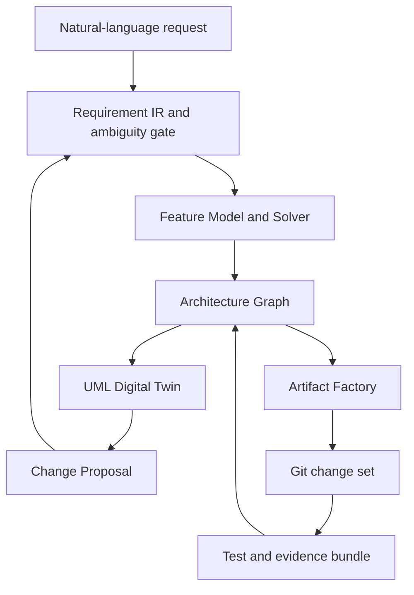

# PAISPL Final Product Blueprint

## Product form

The final system is a Workbench backed by versioned engines and an evidence
store. It exposes a web UI, REST API, and CLI, while producing ordinary Git
repositories that teams can inspect and own.

## Authority hierarchy

1. Approved natural-language intent and Requirement IR define the requested meaning.
2. The Feature Model and Solver decide configuration validity.
3. The Architecture Graph defines the selected structural realization.
4. UML explains and reviews that structure; it is not an independent truth source.
5. Generated artifacts realize the approved graph and are reproducible outputs.
6. Evidence records prove which request, model, test, and approval produced a file.

## User workflow

1. Enter a requirement or change in natural language.
2. Review extracted intents, uncertainty, and unresolved questions.
3. Solve the feature configuration and explain conflicts when unsatisfiable.
4. Preview component, interface, deployment, test, and security impact in UML.
5. Approve the change boundary.
6. Generate only required files and preserve byte-identical unaffected files.
7. Execute contract, integration, policy, security, and regression tests.
8. Produce a Git-ready change set and immutable evidence bundle.

## Final deliverables

- PAISPL Workbench: web UI, API, CLI, authentication, project history.
- Core engines: IR validator, Solver, architecture synthesizer, impact closure.
- Artifact Factory: code templates, contracts, Kubernetes/GitOps, migration hooks.
- UML Digital Twin: component, sequence, state, and deployment projections.
- Round-trip controller: UML edit to Change Proposal and Solver revalidation.
- Healthcare Domain Pack: Feature Model, reference architecture, constraints, tests.
- Evaluation Pack: Gold sets, mutation cases, measurements, raw results, scripts.
- Research Pack: paper manuscript, appendices, replication package, threat analysis.

## Remaining milestones

| Milestone | Primary output | Exit criterion |
|---|---|---|
| M4 | UML round-trip change controller | No UML edit bypasses Requirement IR or Solver |
| M5 | Natural-language intent compiler | Ambiguity and confidence calibrated on labeled corpus |
| M6 | Experiment and benchmark harness | Gold, mutation, ablation, and statistical reports reproducible |
| M7 | Integrated Workbench | End-to-end scenario operable through UI/API/CLI |
| M8 | Production and paper hardening | Security, observability, governance, and manuscript complete |

## Target research metrics

- semantic intent accuracy and ambiguity recall;
- configuration validity and conflict-explanation accuracy;
- architecture-impact precision and recall;
- unaffected-artifact preservation ratio;
- regeneration time and changed-line reduction;
- requirement-to-test-to-artifact trace completeness;
- UML round-trip semantic consistency;
- repeatability across clean environments.

